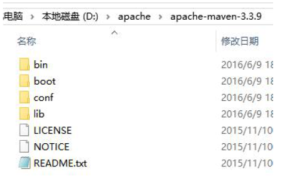
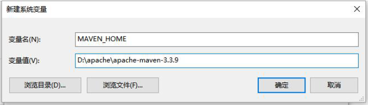
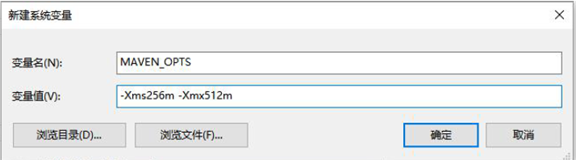
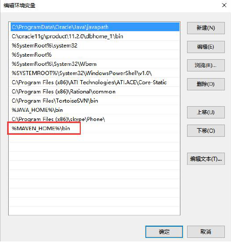
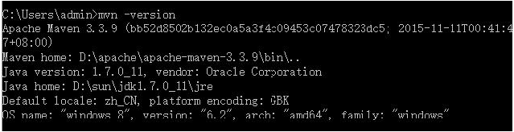

# 2 Maven安装与配置

## 2.1 下载和安装

### 2.1.1 环境要求

Maven 3.3+ 需要使用jdk 1.7+

### 2.1.2 下载

下载地址：

    http://maven.apache.org/download.cgi

### 2.1.3 解压文件

解压maven压缩包“apache-maven-3.3.9-bin.zip”到一个路径（尽量编码路径中不要包含中文）。

 

### 2.1.4 了解Maven目录

bin：含有mvn 运行的脚本  
boot：含有plexus-classworlds 类加载器框架  
lib：含有Maven 运行时所需要的java 类库  
conf：含有settings.xml 配置文件  

settings.xml 中默认的用户库: ${user.home}/.m2/repository[通过maven下载的jar包都会存储到此仓库中]

### 2.1.5 添加系统环境变量MAVEN_HOME

MAVEN_HOME : E:\apache-maven-3.3.9-bin（注意：配置为你自己的maven 路径）

 

MAVEN_OPTS : -Xms256m -Xmx512m（注意：可以不配置）

### 2.1.6 设置系统环境变量Path

在Path中追加: %MAVEN_HOME%\bin

### 2.1.7 验证

打开cmd 输入：mvn –version

