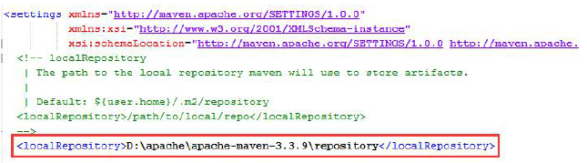

## 2.3 配置本地库

Maven的默认本地仓库在：${user.home}/.m2/repository ；这地址可以在settings.xml 中修改指定自定义的仓库路径。

自定义仓库路径
找到${maven_home}/conf/settings.xml 文件，修改如下：

  

需要注意的是上图中的自定义路径必须存在。
repository 是本地仓库，也即本地下载的jar存放路径，在资料中解压“repository.zip”当对应目录，然后将这个解压后路径配置到上述地址即可。（不使用解压的也是可以的，那么以后需要依赖包时需要联网自动下载。）
