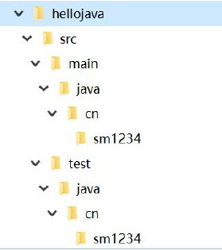

# 4 命令行方式构建Maven项目

## 4.1 创建Maven项目

### 4.1.1 使用命令行创建java项目

在命令行中可以通过Maven 中的命令（插件）可以自动创建文件结构和自动生成pom.xml 文件。

#### 4.1.1.1 执行cmd命令

    mvn archetype:generate -DarchetypeCatalog=internal -DgroupId=cn.sm1234 -DartifactId=hellojava -DarchetypeArtifactId=maven-archetype-quickstart -Dversion=0.0.1-snapshot

#### 4.1.1.2 创建结果

 

#### 4.1.1.3 参数说明

* mvn archetype:generate

核心命令mvn 框架，生成Maven 项目最基本的目录结构。

* -DarchetypeCatalog=internal

读取archetype-catalog.xml 文件的位置；内置的。

* -DgroupId=cn.sm1234

公司域名倒写

* -DartifactId=hellojava

项目名称

* -DarchetypeArtifactId=maven-archetype-quickstart

Maven 项目的模板；这是最简单的Maven 项目模板。

* -Dversion=0.0.1-snapshot

项目版本号，snapshot 内测版，release 正式发行版
