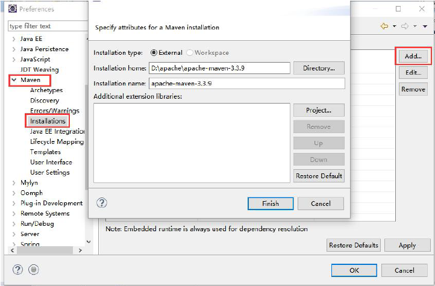
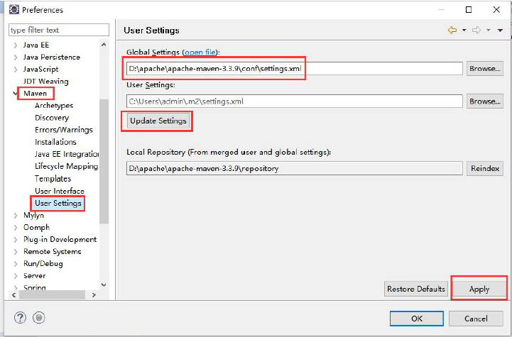

## 5.2 配置Eclipse Maven环境

在Eclipse中使用Maven进行构建需要m2eclipse插件；m2eclipse插件（http://eclipse.org/m2e/）为Eclipse提供了Maven的集成。新版的Eclipse默认安装了m2eclipse插件，如果是旧版的则需要先安装m2eclipse 插件。  

### 5.2.1 配置Maven地址

 
 
### 5.2.2 设置setting.xml地址

 
 
指定全局的setting.xml 配置文件的路径。
