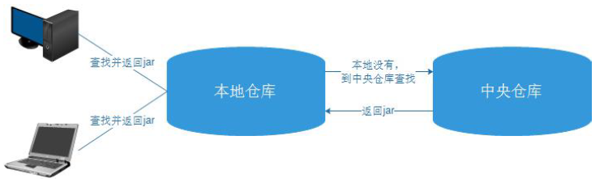
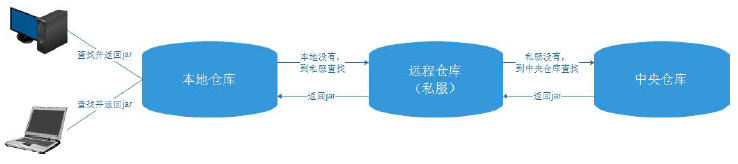

# 6 Maven核心概念

## 6.1 仓库

Maven在某个统一的位置存储所有项目的共享的构件，这个统一的位置，就称之为仓库。（仓库就是存放依赖和插件的地方）Maven的仓库有两大类：  
1：本地仓库2：远程仓库

在远程仓库中又分成了3种：  
中央仓库、私服、其它公共库。

### 6.1.1 本地仓库

就是Maven 在本机存储构件的地方。  
maven 的本地仓库，在安装maven 后并不会创建，它是在第一次执行maven 命令的时候才被创建。  
maven本地仓库的默认位置：在用户的目录下都只有一个.m2/repository/的仓库目录。  
本地仓库位置是可以修改的。

### 6.1.2 中央仓库

包含了绝大多数流行的开源Java 构件，以及源码、作者信息、SCM、信息、许可证信息等。
开源的Java 项目依赖的构件都可以在这里下载到：
http://repo1.maven.org/maven2/

### 6.1.3 私服

私服是一种特殊的远程仓库，它是架设在局域网内的仓库。  

1：没有使用私服的仓库构件下载

 
 
2：使用私服的仓库构件下载
 
 
