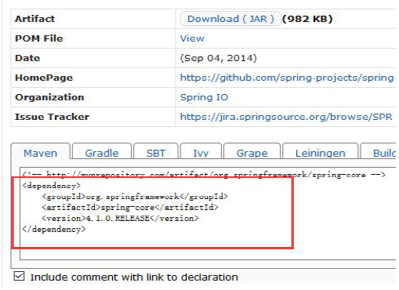

## 6.2 坐标

### 6.2.1 坐标的概念

在平面几何中坐标（x,y）可以标识平面中唯一的一点。

### 6.2.2 坐标的主要组成

* groupId

定义当前Maven 项目隶属项目、组织。

* artifactId

定义实际项目中的一个模块。

* version

定义当前项目的当前版本。

* packaging

定义该项目的打包方式（pom/jar/war，默认为jar）

groupId、artifactId、version 简称为GAV。

### 6.2.3 使用坐标的原因

Maven 世界拥有大量构件，需要找一个用来唯一标识一个构建的统一规范，拥有了统一规范，就可以把查找工作交给机器。

### 6.2.4 获取坐标

    http://mvnrepository.com/
 
网站上可以搜索具体的组织或项目关键字，之后复制对应的坐标到pom.xml 中。
如：

 
