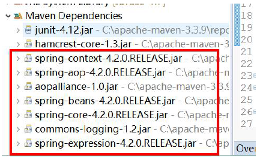
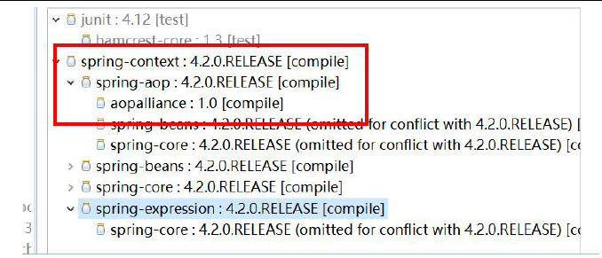
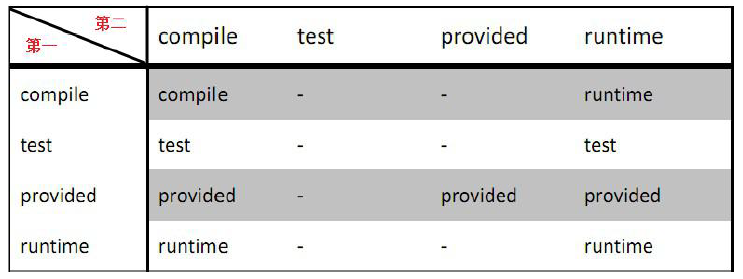
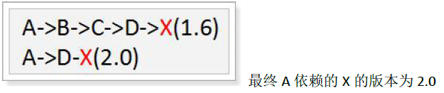
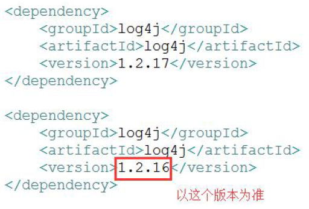

## 6.3 依赖管理

在pom.xml中的节点dependency为一个依赖；  
groupId、artifactId、version是依赖的基本坐标，缺一不可。  
type：依赖的类型，默认为jar，说明需要使用jar 包。  

注意：如果“<type>pom.lastUpdated</type>”有此内容，要进行删除。  

### 6.3.1 依赖范围问题（scope配置）

依赖范围scope 用来控制依赖和编译，测试，运行的classpath 的关系。  
具体的依赖范围有如下6 种：
  
1) compile：编译域，这个是Maven中scope的默认值，我们平时不写scpoe配置时默认就是使用这个值。compile表示被依赖项目需要同当前项目编译时一起进行编译，项目测试期以及本项目运行时期同样生效，打包的时候需要包含进去。  

2) test：测试域，表示被依赖的项目仅在项目进行测试的时候生效，一般将日志等依赖包（如：Junit）配置为test，项目运行时不会生效。  

3) provided：provided 意味着打包的时候可以不用打包进去，别的容器会提供，如Servlet-API，Tomcat 这些容器会提供，所以打包，运行时无需提供。  

4) runtime：运行域，表示被依赖项目不会参与项目的编译，但项目的测试期和运行时期会参与。与compile 相比，跳过了编译这个环节。（如：JDBC 驱动）  

5) system：系统范围，自定义构件，指定systemPath；跟provided 相似，但是在系统中要以外部JAR 包的形式提供，maven不会在repository 查找它。  

6) import：只使用在<dependencyManagement>中，表示从其它的pom 中导入dependency 的配置。  

|依赖范围	|说明	|编译有效	|运行有效	|测试有效	|是否打包	|实际应用|
|-----------|-------|-----------|-----------|-----------|-----------|--------|
|Compile	|编译范围	|Y	|Y	|Y	|Y	|Ssh\poi|
|Test	|测试范围	|Y	|N	|Y	|N	|Junit|
|Provide	|容器范围	|Y	|N	|Y	|N	|Servlet.jar|
|Runtime	|运行范围	|N	|Y	|Y	|Y	|驱动|

### 6.3.2 传递依赖问题

举例：  

当前我们的maven项目导入spring-context的时候，会同时spring-aop,spring-beans,spring-core等依赖导入：

    <dependency>
        <groupId>org.springframework</groupId>
        <artifactId>spring-context</artifactId>
        <version>4.2.0.RELEASE</version>
    </dependency>

 

打开依赖树：
 
 

发现依赖关系是这样的：
 
 

说明：spring-context和spring-aop是第一个直接依赖，而spring-aop和aopapplliance是第二直接依赖。

依赖传递会影响依赖访问：
假设A依赖于B，B依赖于C，我们说A对于B是第一直接依赖，B对C是第二直接依赖，A对于C是传递性依赖。第一直接依赖的范围和第二直接依赖的范围决定了传递性依赖的范围。
对于传递性依赖，依赖的范围如下表：

#### 6.3.2.1 可选依赖（optional 配置）  

在依赖节点dependency 中的<optional>可以控制当前的依赖是否向下传递；默认值为false，表示向下传递。
【示例】A 项目依赖于log4j，然后B 项目依赖于A 项目；那么如果在A 中对log4j 依赖的optional 配置成false 时，B 项目中自动传递依赖于log4j。否则反之。

项目A 配置slf4j 的依赖并设置optional 为true：  

    <dependency>
        <groupId>org.slf4j</groupId>
        <artifactId>slf4j-log4j12</artifactId>
        <version>1.6.4</version>
        <!-- 配置为true 时不向下传递此依赖，默认为false -->
        <optional>true</optional>
    </dependency>

配置项目B 依赖于项目A，检查项目B 的依赖包：  

    <!-- 依赖于itcast-A -->
    <dependency>
        <groupId>cn.sm1234</groupId>
        <artifactId>sm1234-A</artifactId>
        <version>0.0.1-SNAPSHOT</version>
    </dependency>

#### 6.3.2.2 排除依赖（exclusion 配置）  

在pom中的依赖节点中，如果引入的依赖包含了很多其它的传递依赖，而且项目需要的这些依赖的版本和传递依赖的不相符；那么可以在依赖节点中设置排除依赖节点：<exclusions> 然后再添加<exclusion>，其里面的内容包括：  

* 包含坐标
* 排除依赖包中所包含的依赖关系

注：不需要添加版本，直接类别排除  

    <dependency>
        <groupId>org.apache.struts</groupId>
        <artifactId>struts2-spring-plugin</artifactId>
        <version>2.3.24.1</version>
        <exclusions>
            <!-- 排除spring-core 的传递依赖-->
            <exclusion>
                <groupId>org.springframework</groupId>
                <artifactId>spring-core</artifactId>
            </exclusion>
        </exclusions>
    </dependency>
    <dependency>
        <groupId>org.springframework</groupId>
        <artifactId>spring-beans</artifactId>
        <version>4.1.0.RELEASE</version>
    </dependency>

### 6.3.3 依赖冲突问题

#### 6.3.3.1 不同依赖路径的情况

如果依赖的路径不相同的时候，以最短的路径为准。

 
例如：项目A 中，依赖了slf4j1.6.4 版本的包，通过slf4j1.6.4 间接依赖log4j1.2.16
版本；如果项目A 中直接配置了log4j 1.2.17 版本，那么最终的版本为1.2.17。

    <dependency>
        <groupId>org.slf4j</groupId>
        <artifactId>slf4j-log4j12</artifactId>
        <version>1.6.4</version>
        <!-- 配置为true 时不向下传递此依赖，默认为false -->
        <optional>true</optional>
    </dependency>
    <dependency>
        <groupId>log4j</groupId>
        <artifactId>log4j</artifactId>
        <version>1.2.17</version>
    </dependency>

#### 6.3.3.2 相同依赖路径的情况

如果直接依赖中包含有同一个坐标不同版本的资源依赖，以配置顺序下方的版本为准。
例如：

 

如果间接依赖中包含有同一个坐标不同版本的资源依赖，以配置顺序上方的版本为准。

例如：

如下对应spring-core的间接依赖的版本号，以struts2-spring-plugin为准

    <dependency>
        <groupId>org.apache.struts</groupId>
        <artifactId>struts2-spring-plugin</artifactId>
        <version>2.3.24.1</version>
    </dependency>
    <dependency>
        <groupId>org.springframework</groupId>
        <artifactId>spring-beans</artifactId>
        <version>4.1.0.RELEASE</version>
    </dependency>
